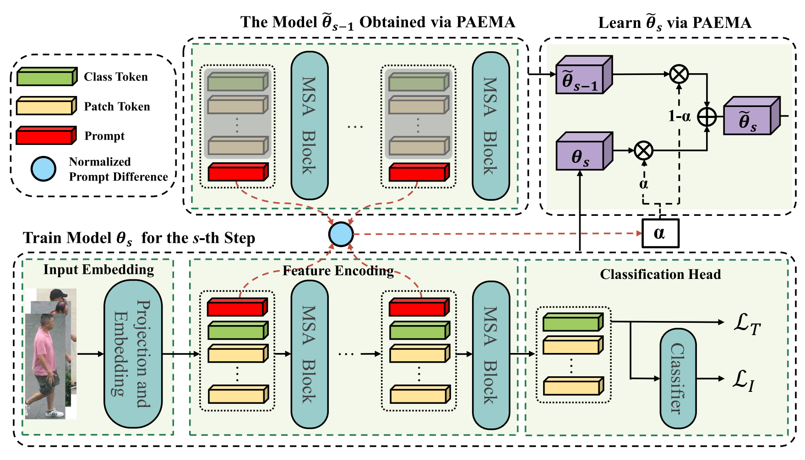

# [IJCV2024] Exemplar-Free Lifelong Person Re-identification via Prompt-Guided Adaptive Knowledge Consolidation
<p align="center">
<a href="https://github.com/zhoujiahuan1991/IJCV2024-PAEMA"></a>
</p>
Official implementation of "[Exemplar-Free Lifelong Person Re-identification via Prompt-Guided Adaptive Knowledge Consolidation](https://link.springer.com/article/10.1007/s11263-024-02110-x)"


<p align="center"></p>

## Requirements

### Environment
Python 3.7.13

PyTorch 1.8.1

### Datasets
Download the person re-identification datasets [Market-1501](https://drive.google.com/file/d/0B8-rUzbwVRk0c054eEozWG9COHM/view), [MSMT17](http://www.pkuvmc.com/dataset.html), [CUHK03](https://github.com/zhunzhong07/person-re-ranking/tree/master/evaluation/data/CUHK03), [SenseReID](https://drive.google.com/file/d/0B56OfSrVI8hubVJLTzkwV2VaOWM/view?resourcekey=0-PKtdd5m_Jatmi2n9Kb_gFQ). Other datasets can be prepared following [Torchreid_Datasets_Doc](https://kaiyangzhou.github.io/deep-person-reid/datasets.html) and [light-reid](https://github.com/wangguanan/light-reid).
Then unzip them and rename them under the directory like
```
PRID
├── CUHK01
│   └──..
├── CUHK02
│   └──..
├── CUHK03
│   └──..
├── CUHK-SYSU
│   └──..
├── DukeMTMC-reID
│   └──..
├── grid
│   └──..
├── i-LIDS_Pedestrain
│   └──..
├── MSMT17_V1
│   └──..
├── MSMT17_V2
│   └──..
├── Market-1501
│   └──..
├── prid2011
│   └──..
├── SenseReID
│   └──..
└── viper
    └──..
```

### ViT Pretrain Model
Download the vit pretrain model from [here](https://github.com/rwightman/pytorch-image-models/releases/download/v0.1-vitjx/jx_vit_base_p16_224-80ecf9dd.pth), and put it in ./pretrained/ 
## Quick Start
GwFReID benchmark:
```shell
bash run.sh 
```

AKA benchmark:
```shell
bash run2.sh 
```


## Citation
If you find this work helpful, please cite:
```
@article{li2024exemplar,
  title={Exemplar-Free Lifelong Person Re-identification via Prompt-Guided Adaptive Knowledge Consolidation},
  author={Li, Qiwei and Xu, Kunlun and Peng, Yuxin and Zhou, Jiahuan},
  journal={International Journal of Computer Vision},
  pages={1--16},
  year={2024},
  publisher={Springer}
}


```

## Acknowledgement
Our code is based on [PatchKD](https://github.com/feifeiobama/PatchKD), [PTKP](https://github.com/g3956/PTKP) and [DKP](https://github.com/zhoujiahuan1991/CVPR2024-DKP).

## Contact

Welcome to our Laboratory Homepage ([OV<sup>3</sup> Lab](https://zhoujiahuan1991.github.io/)) for more information about our papers, source codes, and datasets.
